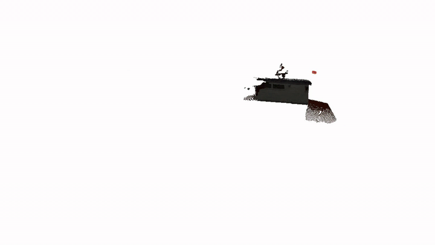

<h1 align="center">CoMo3R-SLAM</h1>
<p align="center"><b>Collaborative Monocular Dense SLAM with Learned 3D Reconstruction Priors<br>for Outdoor Multi-Agent Systems</b></p>

<p align="center">
  
</p>
<p align="center"><i>Two monocular agents, two independent reference frames, one dense map -- each
agent's trajectory is drawn in its own colour.</i></p>

---

### Status of this release

Our paper is currently **under review**. To help the multi-agent dense SLAM
community move forward in the meantime, we are releasing this **basic version**
of CoMo3R-SLAM now, and we will keep opening up the full system as the paper
progresses towards acceptance.

Because the review process is anonymous, **we may not be able to answer GitHub
issues directly**. If your question is truly urgent, please put **`Urgent`** in
the issue title -- we will find a way to help you over email. We hope to keep
contributing to this community.

---

## Overview

Outdoor robot teams need a shared dense map despite limited overlap,
independent reference frames and uncertain monocular scale. CoMo3R-SLAM places
a learned feed-forward 3D reconstruction prior at the centre of that problem:
its dense pointmaps anchor scale across agents and supply correspondences
strong enough to verify inter-agent links geometrically.

* **Per agent** -- one process per RGB stream tracks against its own keyframes
  and refines them with a local Sim(3) Gauss-Newton solve.
* **Coordinator** -- retrieves cross-agent keyframe candidates over the prior's
  encoder features, verifies each one by bidirectional dense pointmap matching,
  synchronizes the agents' independent similarity gauges in closed form, and
  refines every keyframe in a single multi-agent Sim(3) graph.
* **Terminal refinement** -- a pose/depth alternation over geometry-aware
  segments lets inter-agent observations constrain dense structure as well as
  trajectories.

No depth sensor is required, and no camera intrinsics have to be supplied: the
default configuration runs fully uncalibrated. Two agents run at roughly 8 FPS
on RTX 3080 Ti.

### What is in this release

The collaborative system end to end: per-agent tracking and local optimization,
cross-agent retrieval and verification, gauge synchronization, the multi-agent
Sim(3) backend, segment-level depth refinement, and the live multi-agent
viewer. A two-agent example on the Tanks and Temples *Barn* sequence is
included below, from download to visualization.

## Installation

Tested on Ubuntu with an NVIDIA GPU.

```bash
conda create -n como3r-slam python=3.11
conda activate como3r-slam
```

Check the system's CUDA version and install a **matching** PyTorch build:

```bash
nvcc --version

# CUDA 11.8
conda install pytorch==2.5.1 torchvision==0.20.1 torchaudio==2.5.1 pytorch-cuda=11.8 -c pytorch -c nvidia
# CUDA 12.1
conda install pytorch==2.5.1 torchvision==0.20.1 torchaudio==2.5.1 pytorch-cuda=12.1 -c pytorch -c nvidia
# CUDA 12.4
conda install pytorch==2.5.1 torchvision==0.20.1 torchaudio==2.5.1 pytorch-cuda=12.4 -c pytorch -c nvidia
```

Clone this repository and build it. Everything the build needs (the pointmap
prior, the viewer toolkit, Eigen) is vendored under `thirdparty/`:

```bash
git clone https://github.com/como3r-slam/como3r-slam.git
cd como3r-slam

conda install -c "nvidia/label/cuda-11.8.0" cuda-nvcc=11.8 cuda-cudart-dev=11.8
conda install -y "mkl<2025" "intel-openmp<2025" packaging

export CUDA_HOME=$CONDA_PREFIX
export PATH=$CUDA_HOME/bin:$PATH
export LD_LIBRARY_PATH=$CUDA_HOME/lib:$CUDA_HOME/lib64:$LD_LIBRARY_PATH
export CXX=g++-11
export CC=gcc-11

pip install -e thirdparty/mast3r --no-build-isolation

pip install "setuptools<70" "Cython<3" "numpy<2"
pip install --no-cache-dir --no-build-isolation imgui==2.0.0
pip install -e thirdparty/in3d

pip install --no-build-isolation -e .

# optional: faster mp4 loading
pip install torchcodec==0.1
```

### Checkpoints

The pointmap prior and the retrieval codebook are the public MASt3R
checkpoints. Their license and the datasets they were trained on are described
[here](https://github.com/naver/mast3r/blob/mast3r_sfm/CHECKPOINTS_NOTICE).

```bash
mkdir -p checkpoints/
wget https://download.europe.naverlabs.com/ComputerVision/MASt3R/MASt3R_ViTLarge_BaseDecoder_512_catmlpdpt_metric.pth -P checkpoints/
wget https://download.europe.naverlabs.com/ComputerVision/MASt3R/MASt3R_ViTLarge_BaseDecoder_512_catmlpdpt_metric_retrieval_trainingfree.pth -P checkpoints/
wget https://download.europe.naverlabs.com/ComputerVision/MASt3R/MASt3R_ViTLarge_BaseDecoder_512_catmlpdpt_metric_retrieval_codebook.pkl -P checkpoints/
```

## Example: two agents on Barn

The *Barn* sequence of Tanks and Temples is a single 410-frame outdoor
traversal. Splitting it into two windows that share only their ends gives two
agents that never start in the same reference frame and only briefly see the
same structure -- the setting the system is built for.

**1. Download the sequence** (~527 MB; the reference trajectory shipped in
`examples/barn/` is copied in place):

```bash
bash scripts/download_barn.sh
```

**2. Split it into two agent streams** with a 5% overlap:

```bash
python scripts/split_agents.py --scene data/Barn --num-agents 2 --overlap 0.05
# data/Barn/agent1 -> frames 000001-000215
# data/Barn/agent2 -> frames 000196-000410
```

**3. Run the system with the live viewer:**

```bash
python multi_agent_main.py \
    --agents data/Barn/agent1 data/Barn/agent2 \
    --config config/multi_agent.yaml \
    --save-as barn
```

Each agent gets its own colour in the viewer. The two maps start as separate
clouds; once the coordinator verifies the first inter-agent link the gauges are
synchronized and the maps snap into one. Useful toggles in the GUI panel:
`show_keyframe_edges` draws the factor graph (inter-agent edges included),
`follow cam` locks the view to one agent, `C_conf_threshold` prunes
low-confidence points, and `show_full_traj` overlays the every-frame
trajectories once processing has finished.

Processing keeps running while the window is open; **close the viewer window**
to write the results out. Add `--no-viz` to run headless, and `--max-frames N`
to cap each stream.

Streaming the two agents through the sequence is the fast part; the terminal
pose/depth alternation that runs once both agents are done dominates the wall
clock. End to end the example takes about 12 minutes on a laptop RTX 3080 Ti.
Lower `multi_agent.final_alt_rounds` in the config for a quicker look -- the
online part of the system is unaffected.

As a sanity check, the run above should report an ATE of roughly 0.07-0.11 m
per agent on the keyframe trajectories, with 60-70 keyframes and several
dozen accepted inter-agent edges.

### Outputs

Everything lands in `logs/<--save-as>/`:

| file | contents |
| --- | --- |
| `agent_<i>.txt` | keyframe trajectory of agent *i*, TUM format, in the shared global frame |
| `agent_<i>_full.txt` | every-frame trajectory of agent *i*, TUM format |
| `joint_reconstruction.ply` | the fused multi-agent point cloud |
| `per_frame_agent_<i>.npz` | per-frame poses relative to their keyframe anchor |

If [`evo`](https://github.com/MichaelGrupp/evo) is installed (it is a
dependency) and the scene ships a `gt_traj.txt`, the run also prints the ATE
per agent under Sim(3) Umeyama alignment.

## Running on your own data

Every `--agents` entry is a folder of RGB images (`.jpg` / `.png`), one folder
per agent, and the folders may be recorded independently:

```bash
python multi_agent_main.py \
    --agents /path/to/agent1 /path/to/agent2 /path/to/agent3 \
    --config config/multi_agent.yaml \
    --save-as my_run
```

Useful knobs:

* `--global-kf-buffer N` -- slots in the shared keyframe store. It is allocated
  on the GPU up front and cannot grow, so it must cover the **total** keyframe
  count of all agents (~9 MiB per slot). Raise it for long sequences.
* `dataset.subsample` in the config -- process every *n*-th frame (2 by
  default).
* `--expandable-segments` -- reduces allocator fragmentation on long runs, but
  fails on hosts whose container runtime blocks `pidfd_getfd`.

If you do know the camera intrinsics, put them in an intrinsics YAML (see
`config/intrinsics.yaml`) and run the calibrated config:

```bash
python multi_agent_main.py \
    --agents /path/to/agent1 /path/to/agent2 \
    --config config/multi_agent_calib.yaml \
    --calib config/intrinsics.yaml
```

## Acknowledgement

We sincerely thank the developers and contributors of the open-source projects
this code is built upon.

* [MASt3R-SLAM](https://github.com/rmurai0610/MASt3R-SLAM)
* [MASt3R](https://github.com/naver/mast3r) and
  [MASt3R-SfM](https://github.com/naver/mast3r/tree/mast3r_sfm)
* [DROID-SLAM](https://github.com/princeton-vl/DROID-SLAM)
* [ModernGL](https://github.com/moderngl/moderngl)
* [Tanks and Temples](https://www.tanksandtemples.org/)

## License

CC BY-NC-SA 4.0. See [LICENSE.md](LICENSE.md) and
[Dependencies.md](Dependencies.md).

## Citation

The paper is under review and the citation is withheld while the review is
anonymous. It will be added here once the review process allows it.
